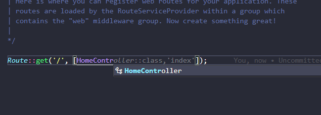

# AULA DE 28/09/2023

## Continuação do sistema de Blog - Views e controllers


Agora que construimos nossa view de home e post, agora vamos entender como funciona o controller e como ele se relaciona com as views.

### O que é um controller?
O controller é responsável por receber uma requisição que vem da rota e retornar uma resposta. Até o momento, ao definir as rotas nós definimos uma função que retorna uma view, mas o ideal é que a lógica da aplicação fique em um controller e não em uma rota. Por exemplo, quando o usuário acessa a página principal do sistema, a rota é responsável por chamar o método de um controller que irá carregar a página principal do sistema. Quando o usuário acessa a página de login, a rota é responsável por chamar o método de um controller que irá carregar a página de login.


### Como criar um controller?

Na aula passada, usamos o seguinte código para retornar a nossa página de home:

```php

Route::get('/', function () {
	return view('home');
});
```

A função que está presente na rota é chamada de **closure**. O closure é uma função anônima, isto é, uma função que não possui nome. O closure é uma função que recebe uma requisição e retorna uma resposta. No nosso caso, a resposta é uma view. 

Agora, como o fluxo do sistema usa MVC, temos que fazer com que essa view seja retornada por um controller. Para isso, vamos criar um controller chamado `HomeController` que será responsável por
várias coisas, inclusive retornar a view de home. Para criar um controller, nós temos duas opções:

```php

php artisan make:controller HomeController
```

ou 

```php

php artisan make:controller HomeController --resource
```

A diferença entre os dois comandos é que o primeiro comando cria um controller comum, isto é, um controller que não possui os métodos de CRUD (crud é um acrônimo para Create, Read, Update e Delete). O segundo comando cria um controller com os métodos de CRUD. Nós iremos usar o primeiro porque não iremos usar os métodos de CRUD.

Após criar o controller, nós iremos criar um método chamado `home` que será responsável por retornar a view de home. Para isso, nós iremos usar o seguinte código:

```php

public function home() {
	return view('home');
}
```

Agora na nossa rota, nós iremos chamar o método `home` do controller `HomeController`. Para isso, nós iremos usar o seguinte código:

```php

Route::get('/', [HomeController::class, 'home']);
```

Repare na forma que nós chamamos o método `home` do controller `HomeController`. Nós usamos o nome da classe `HomeController` e o nome do método `home` dentro de um array.

Uma dica: quando estiver digitando o nome `HomeController`, você pode usar o atalho `ctrl + space` para o vscode mostrar o nome da classe, então você escolhe a classe relacionada ao nosso controller.

Veja a foto abaixo:

[


Agora vamos criar o método `post` que será responsável por retornar a view de um post. Para isso, nós iremos usar o seguinte código dentro do controller `HomeController`:

```php

public function post() {
	return view('post');
}
```

Agora na nossa rota, nós iremos chamar o método `post` do controller `HomeController`. Para isso, nós iremos usar o seguinte código:

```php

Route::get('/post', [HomeController::class, 'post']);
```

#### Criando todos os controllers do nosso sistema

Até o momento, nós criamos apenas o controller `HomeController` que ficará responsável apenas pelas views de home e post. Mas nós precisamos criar outros controllers para o nosso sistema. Para isso, nós iremos usar o seguinte comando:

```php
php artisan make:controller UserController --resource
```

O comando acima irá criar um controller chamado `UsuarioController` com os métodos de CRUD. Nós iremos usar esse controller para fazer o CRUD de usuários.

```php

php artisan make:controller PostController --resource
```

O comando acima irá criar um controller chamado `PostController` com os métodos de CRUD. Nós iremos usar esse controller para fazer o CRUD de posts.

```php
php artisan make:controller CategoriaController --resource
```

O comando acima irá criar um controller chamado `CategoriaController` com os métodos de CRUD. Nós iremos usar esse controller para fazer o CRUD de categorias.

```php
php artisan make:controller ComentarioController --resource
```

**obs**: CRUD é um acrônimo para Create, Read, Update e Delete. CRUD é um conjunto de ações que são necessárias para um sistema de banco de dados funcionar. Por exemplo, um sistema de blog precisa de um CRUD de posts para funcionar, isto é, ação de criar, ler, atualizar e deletar posts.

**obs**: perceba que agora nós usamos o comando `--resource` para criar um controller com os métodos de CRUD. Isso vai facilitar o nosso trabalho porque nós não precisaremos criar os métodos de CRUD manualmente.

### Rotas para os controllers

#### Nomeando nossas rotas

Até o momento, nós definimos as rotas usando o método `get` e passando como parâmetro a url. Mas nós podemos nomear as rotas para facilitar a chamada das rota pois imagina o seguinte cenário: você tem uma rota `site.com/produtos/34/editar` mas quer usar algo mais curto para chamar essa rota, então você pode usar o nome da rota para chamar ela. Para isso, nós iremos usar o seguinte código:

Na rota de HomeController;
```php

Route::get('/', [HomeController::class, 'index'])->name('home');
```

agora na rota de post ainda no controller de home;
```php

Route::get('/post', [HomeController::class, 'post'])->name('post');
```
`O name('home')` é uma função que recebe como parâmetro o nome da rota. No nosso caso, o nome da rota é `home` e `post`, mas poderia ser o que você quisesse.


**Mas como usar o nome da rota para chamar a rota? Para isso, nós iremos usar o seguinte código:**

```php
<a href="{{ route('home') }}">Home</a>
```

Veja que nós usamos a função `route` para chamar a rota em uma tag HTML da view. A função `route` recebe como parâmetro o nome da rota. No nosso caso, o nome da rota é `home`.

#### Grupos de rotas

Até o momento, nós definimos as rotas usando o método `get` e passando como parâmetro a url. Mas nós podemos agrupar as rotas para facilitar a chamada das rotas. Por exemplo, nós podemos agrupar as rotas de post para que todas as rotas de post tenham o prefixo `/post`. Para isso, nós iremos usar o seguinte código:

```php

Route::prefix('/post')->group(function() {
	Route::get('/', [PostController::class, 'index'])->name('posts.index');

	Route::get('/create', [PostController::class, 'create'])->name('posts.create');
});
```


#### Todas as rotas com um comando

Além do grupo de rotas, nós podemos definir todas as rotas de um recurso (controller) com um comando. Para isso, nós iremos usar o seguinte código:

```php

Route::resource('posts', PostController::class);
```

Esse comando irá criar todas as rotas daquele controller incluindo também os seus names. Por exemplo, o comando acima irá criar as seguintes rotas:

```php

Route::get('/posts', [PostController::class, 'index'])->name('posts.index');

Route::get('/posts/create', [PostController::class, 'create'])->name('posts.create');

Route::post('/posts', [PostController::class, 'store'])->name('posts.store');

Route::get('/posts/{post}', [PostController::class, 'show'])->name('posts.show');

Route::get('/posts/{post}/edit', [PostController::class, 'edit'])->name('posts.edit');

Route::put('/posts/{post}', [PostController::class, 'update'])->name('posts.update');

Route::delete('/posts/{post}', [PostController::class, 'destroy'])->name('posts.destroy');
```

### Criando as rotas do nosso sistema

Agora que nós já sabemos como criar um controller e como criar rotas para esse controller, nós iremos criar as rotas do nosso sistema. Para isso, nós iremos usar o seguinte código:

```php

Route::get('/', [HomeController::class, 'index'])->name('home');

Route::get('/post', [HomeController::class, 'post'])->name('post');

Route::resource('posts', PostController::class);

Route::resource('categorias', CategoriaController::class);

Route::resource('usuarios', UsuarioController::class);

Route::resource('comentarios', ComentarioController::class);
```

Dessa forma, nós criamos todas as rotas do nosso sistema até o momento. Mas só usaremos as rotas do controller `HomeController`. As outras rotas nós iremos usar mais para frente.
